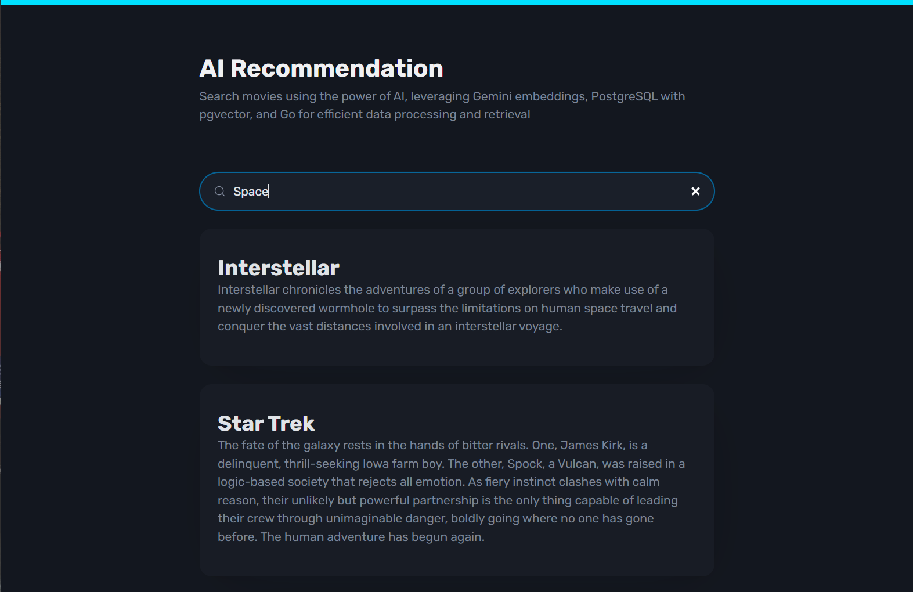

# AI Recommendation Service

This project uses PostgreSQL with the **pgvector** extension to store and manage vector embeddings for AI-based search. It integrates with the Gemini API to generate embeddings and provides a server to handle recommendation requests.

## Features
- PostgreSQL database with **pgvector** for efficient vector storage and similarity search.
- Integration with the Gemini API for generating vector embeddings.

## UI Preview



## Getting Started

### Prerequisites
- Go 1.26 or later
- Docker + Docker Compose
- Gemini API key (set as `GEMINI_API_KEY`)

### Installation

1. Setup environment variables: copy `.env.example` to `.env` and fill in the required values (including `GEMINI_API_KEY`).
2. Start PostgreSQL with pgvector using Docker Compose:
   ```bash
   docker compose up -d
   ```
3. Install Go dependencies:
   ```bash
   go mod download
   ```

4. Import movie dataset and generate embeddings:
   ```bash
   make import
   ```

5. Run server:
   ```bash
   make run
   ```

## Using the Service

### Generating Embeddings

To generate embeddings for the movie dataset, send a POST request to the `/v1/movies/generate-embeddings` endpoint.

```bash
 curl -X POST http://localhost:9999/v1/movies/generate-embeddings
```

### Searching for Movies

To search for movies, send a GET request to the `/v1/movies` endpoint with the `query` parameter.

```bash
curl -X GET http://localhost:9999/v1/movies?query=bat
```

# Links

- https://github.com/pgvector/pgvector
- https://github.com/pgvector/pgvector-go
- https://ai.google.dev/gemini-api/docs/embeddings